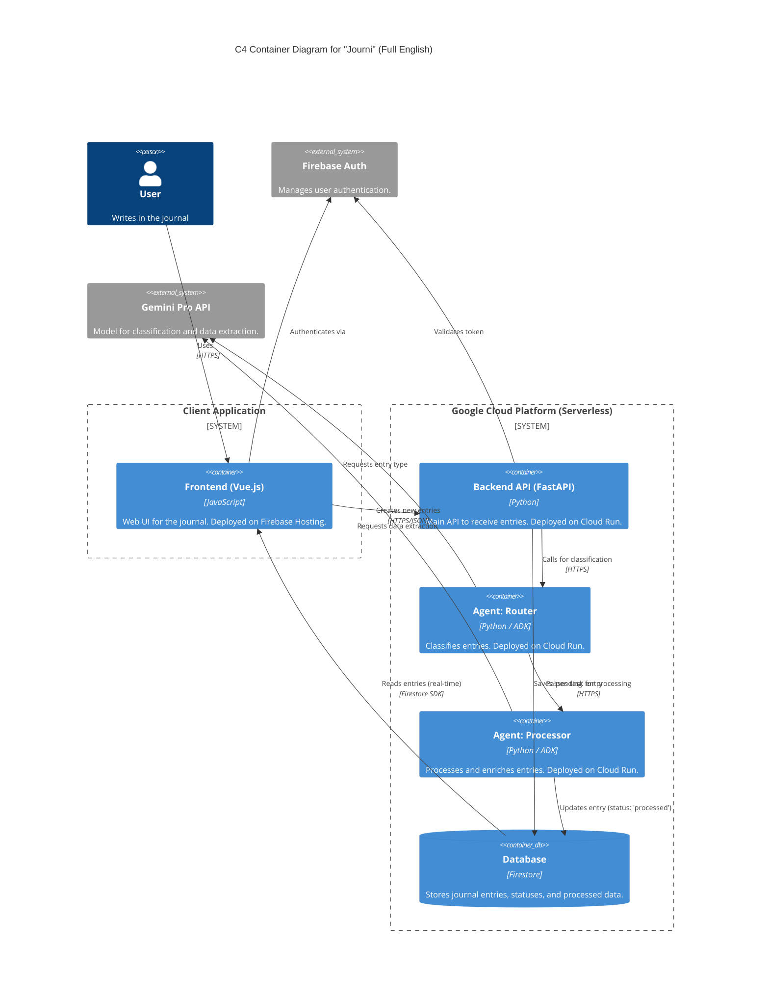
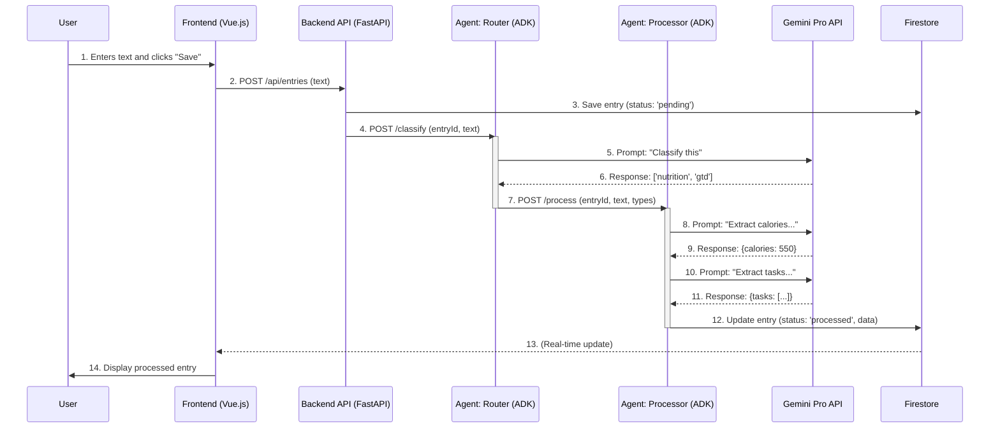

# 🚀 Journi: The AI-Powered Agent Journal

"Journi" is an intelligent journal application built for the **Google Cloud Run Hackathon**. It uses a multi-agent AI system deployed on Cloud Run to automatically classify, process, and enrich journal entries in real-time.

A user writes a raw note (e.g., "Ate a salad (300 kcal) and need to go to the gym tomorrow"), and the "Journi" agents automatically categorize this as `nutrition` and `gtd`, extract the calories, and create a new task.

---

## 🛠️ Tech Stack

*   **Category:** 🤖 **AI Agents Category**
*   **Frontend:** **Vue.js**
*   **Backend API (Gateway):** **Python (FastAPI)**
*   **AI Agents:** **Python (FastAPI)** + **Google Agent Development Kit (ADK)**
*   **AI Model:** **Gemini Pro** (via Google AI)
*   **Database:** **Firestore** (for real-time updates)
*   **Authentication:** **Firebase Authentication**
*   **Deployment:**
    *   **Google Cloud Run** (for all 3 backend services)
    *   **Firebase Hosting** (for the Vue.js frontend)

---

## 🏗️ Architecture Diagrams

### 1. C4 Container Diagram

This diagram shows the main components of the system and their relationships.



### 2. Sequence Diagram (Data Flow)

This diagram shows the real-time communication flow between the user, the API, and the AI agents.



---

## 📦 Services

### 1. `journi-client` (Frontend)

*   **Purpose:** The web interface for users to write and view journal entries.
*   **Framework:** Vue.js
*   **Key Dependencies:**
    *   `vue`: The core Vue.js framework.
    *   `vue-router`: For client-side routing.
    *   `pinia`: For state management.
    *   `vite`: For the build tooling.
    *   `tailwindcss`: For styling.

### 2. `journi-router` (Backend API)

*   **Purpose:** The main entry point for the backend. It receives new journal entries from the client, saves them to Firestore with a "pending" status, and triggers the agent workflow by calling `journi-agent-router`.
*   **Framework:** FastAPI (Python)
*   **Key Dependencies:**
    *   `fastapi`: The web framework.
    *   `uvicorn`: The ASGI server.
    *   `google-cloud-firestore`: To interact with the Firestore database.
    *   `httpx`: To make asynchronous requests to the agent services.
*   **Note:** This service appears to be missing from the project's file structure but is a critical part of the architecture. It is referred to as `journi-gateway` in other parts of the documentation.

### 3. `journi-agent-router` (AI Agent)

*   **Purpose:** This agent is responsible for classifying the incoming journal entry. It receives the text, calls the Gemini API to determine the categories (e.g., `nutrition`, `gtd`), and then forwards the request to the appropriate processing agent.
*   **Framework:** FastAPI (Python)
*   **Key Dependencies:**
    *   `fastapi`
    *   `uvicorn`
    *   `google-generativeai` (for Gemini)
    *   `httpx`

### 4. `journi-agent-processor` (AI Agent)

*   **Purpose:** This is the final agent in the chain. It receives the classified entry and performs the actual data extraction. Based on the categories, it calls the Gemini API with specific prompts to extract structured data (like calories, tasks, etc.). It then updates the entry in Firestore with the processed data and sets the status to "processed".
*   **Framework:** FastAPI (Python)
*   **Key Dependencies:**
    *   `fastapi`
    *   `uvicorn`
    *   `gunicorn`
    *   `google-generativeai` (for Gemini)
    *   `google-cloud-firestore`

---

## 🚀 Getting Started

### Prerequisites

*   Node.js (for the frontend)
*   Python 3.11+ (for the backend services)
*   `GEMINI_API_KEY` environment variable set with your Google AI API key.

### Frontend (`journi-client`)

```bash
# Navigate to the client directory
cd journi-client

# Install dependencies
npm install

# Run the development server
npm run dev
```

### Backend Services (`journi-gateway`, `journi-agent-processor`)

Each backend service is a standard FastAPI application and can be run locally using `uvicorn`.

```bash
# Navigate to the service directory (e.g., journi-gateway)
cd journi-gateway

# Install dependencies
pip install -r requirements.txt

# Run the service (example for gateway)
# You will need to set the AGENT_ROUTER_URL environment variable
export AGENT_ROUTER_URL="http://localhost:8081" # Or the deployed URL
uvicorn main:app --host 0.0.0.0 --port 8080
```

Deployment is handled via Docker and Google Cloud Run. Each service has its own `Dockerfile`.
